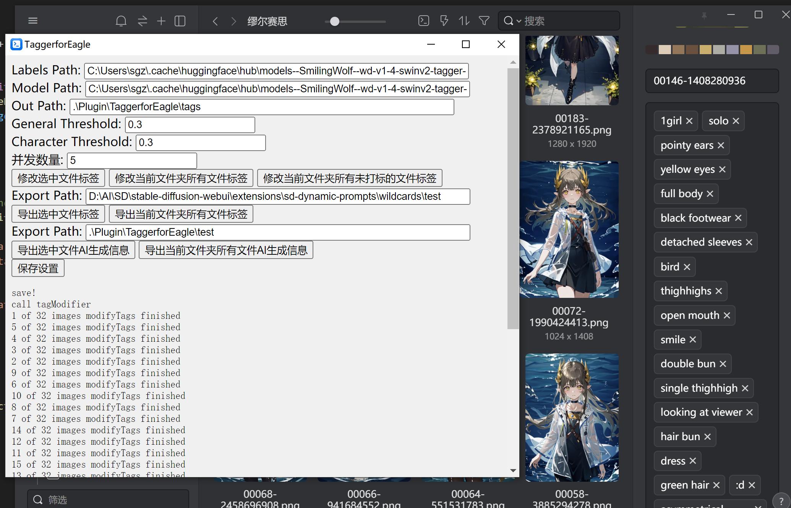

## 功能：
可以识别选中图片，文件夹中图片，自动打标，输出标签到适用于wildcards的txt文件和方便做成excel 的tsv文件

5.20 可以导出已有标签至txt，可以导出AI生成时的自带信息，输出为json，并可以将其中的prompt部分转换成wildcards

暂时只支持windows。mac没试过

## demo


## 使用
0. **下载**：项目主页右上角code-Download zip。将下载文件放到你想放的插件位置，推荐放到Eagle\Plugin\，解压文件。

1. **安装Python 3**：请访问[Python官网](https://www.python.org/downloads/)下载并安装Python 3。安装过程中，请确保勾选“Add Python to PATH”选项，以便将Python添加到系统路径中。

2. **安装 Python 依赖库**
    - 双击运行 `install.bat` 文件以自动安装项目所需的 Python 库。它将打开一个命令行窗口，并开始自动安装所需的 Python 库。安装过程中，您可能会看到一些进度信息和警告。通常，这些警告可以忽略。
    - 如果在运行过程中出现错误，这可能是由于某些依赖库未能正确安装。在这种情况下，请尝试手动安装依赖库。
        1. 创建一个 Python 虚拟环境（venv）：
            ```
            python -m venv venv
            ```
        2. 激活虚拟环境。在 Windows 上，运行：
            ```
            venv\Scripts\activate
            ```
        3. 激活虚拟环境后，使用 `pip` 手动安装项目所需的库。这些库应该在 `requirements.txt` 文件中列出。运行以下命令以安装库：
            ```
            pip install -r requirements.txt
            ```
    - 安装完成后，您可以继续进行下一步。

3. **安装Node.js**：请访问[Node.js官网](https://nodejs.org/en/download/)下载并安装Node.js。安装完成后，打开当前文件夹的powershell，运行
```
npm install python-shell
npm install exifreader
```

4. **下载tagger模型**：在命令行中运行以下命令以克隆tagger模型：
```
git clone https://huggingface.co/SmilingWolf/wd-v1-4-swinv2-tagger-v2/
请确保模型文件夹中包含所需的csv文件（selected_tags.csv）和模型文件（model.onnx），将文件夹放在你想放的位置，记住其地址，填写到之后的插件设置中。您还可以从[SmilingWolf的Hugging Face主页](https://huggingface.co/SmilingWolf)中选择其他模型。
```

5. **若您使用过WebUI的tagger**：如果您已经使用过WebUI的tagger，可以直接使用默认设置。WebUI的默认文件位置在`~\.cache`文件夹中。您只需更改其中的用户名即可。

6. **配置插件**：从eagle导入并打开插件，填写模型和模型标签保存位置。输入用于保存标签集的文件名（不需要添加文件扩展名，程序会自动保存为适用于wildcards的txt文件和方便导入Excel的tsv文件），并设置阈值。

7. **选择功能**：保存设置后，选择要使用的功能。


## 说明：
1. 注意这里的tagger用的是cpu，可能会很卡，如果太卡可以把plugin.js的并行数减小一点

2. 由于异步的关系，输出的序号可能有点问题，不是按顺序来的

3. 文件夹会递归查找所有子文件夹的图片

4. 多次打标同一文件会在tag输出文件输出多次同一tag，但不会对图片文件增加同一tag。这会浪费计算资源，建议使用对未tag的文件打标的那个选项

## 致谢：
主要的tagger部分代码：Nubulae
主要的js部分代码：GPT-4
